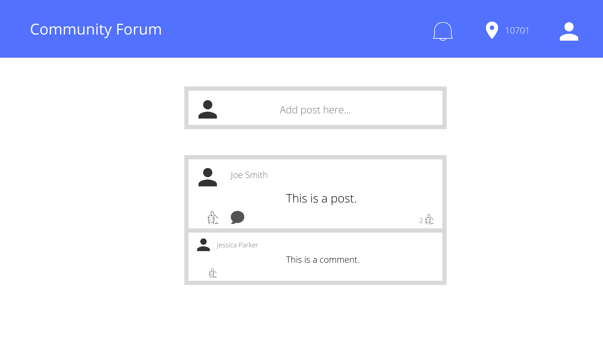
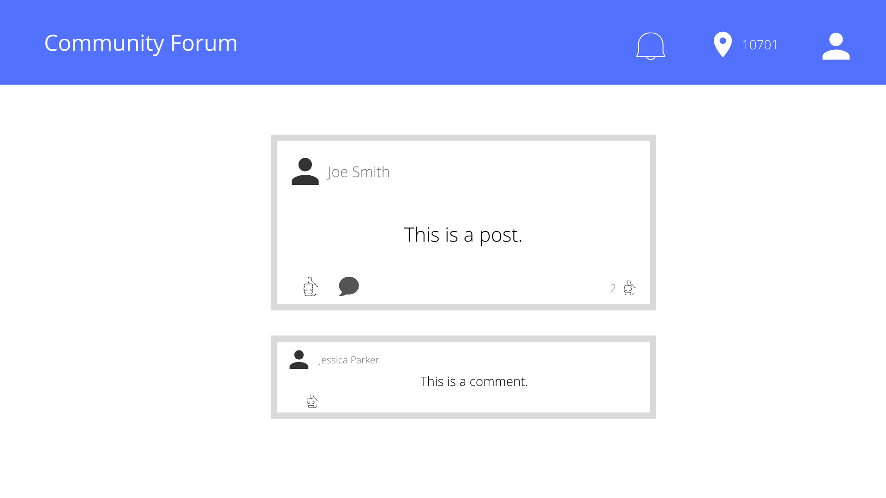
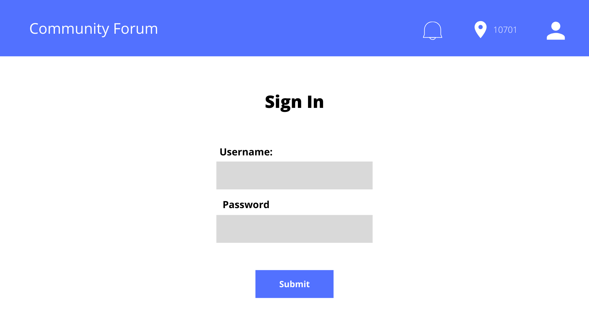
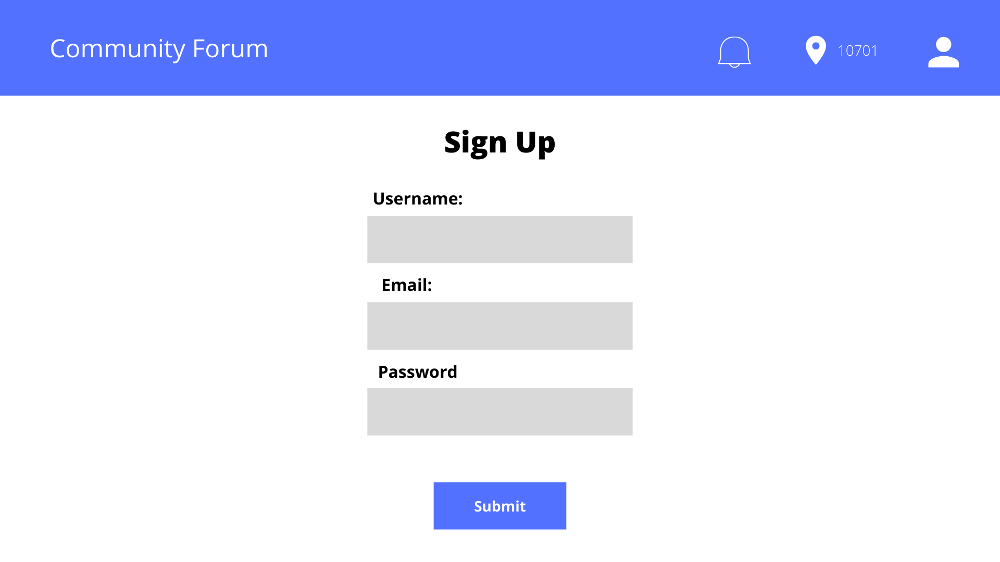

- [Overview](#overview)
- [MVP](#mvp)
  - [Goals](#goals)
  - [Libraries](#libraries)
  - [Client (Front End)](#client-front-end)
    - [Wireframes](#wireframes)
    - [Component Tree](#component-tree)
    - [Component Hierarchy](#component-hierarchy)
    - [Component Breakdown](#component-breakdown)
    - [Component Estimates](#component-estimates)
  - [Server (Back End)](#server-back-end)
    - [ERD Model](#erd-model)
- [Post-MVP](#post-mvp)
- [Code Showcase](#code-showcase)
- [Code Issues & Resolutions](#code-issues--resolutions)

<br>

## Overview

_**Community Forum** is a neighborhood forum for news, events, services, and recommendations. Users can post text and images as well as like and comment on user posts._


<br>

## MVP

- User sign up/sign in/log out
- User can create/edit/delete posts
- User can create/edit/delete comments on a post
- Posts are displayed as a newsfeed 
- Posts can be individually selected and viewed

### Server (Back End)
- Have a RESTful JSON API.
- Build a Ruby on Rails server, exposing RESTful JSON endpoints.
- Build a database with at least 3 tables:
  - 1 user table
  - 2 other tables, of your choosing
- There must be at least 1 association between your tables. (1:m or m:m)
- Utilize Rails to define models for interacting with the database.
- Implement Authentication using JWT.
- Implement working generic controller actions for full-CRUD (index, show, create, update, delete) between the 2 non-user tables AND partial-CRUD (create, at least) for the user table.
### Client (Front End)
- Have a working, interactive React app, built using npx create-react-app.
- Have at least 8 separate, rendered components in an organized and understandable React file structure.
- Utilize functional and class React components appropriately.
- Utilize state and props in your components efficiently.
- Use only React for DOM Manipulation.
- Consume data from your Ruby on Rails API, and render that data in your components.
- Utilize React Router, for client-side routing.
- Utilize Authentication, permitting the user to:
- Register, login, and send authenticated requests.
- Perform index or show actions, whether or not they are logged in.
- Perform create, update, and delete actions when logged in.
- Unless it makes sense for that information to be restricted to particular users.

### Styling
- Be styled with CSS (or SCSS, if you'd prefer).
- Use flexbox or Grid in your layout design.
- Implement 2 media queries for responsive design on 3 screen sizes (including desktop).


<br>

### Goals

- Get to MVP by Friday
- Build full-stack app with CRUD
- Implement Auth and user persmissions to register, login, create posts, update posts, delete posts, and like posts.

<br>

### Libraries


|     Library      | Description                                |
| :--------------: | :----------------------------------------- |
|      React       | _Front-end framework._ |
|   React Router   | _Routes._ |
|   Ruby on Rails   | _Back-end framework._ |

<br>

### Client (Front End)

#### Wireframes

https://whimsical.com/YCQgF8jkte44GY1JqEp1ZR

<br />




- Desktop Landing/Show Posts



- Desktop One Post



- Desktop Sign In



- Desktop Sign Up


#### Component Tree

https://app.lucidchart.com/invitations/accept/0e47a9dc-dacf-4320-a04b-dd9731a79dac


#### Component Hierarchy

``` structure

src
|__ assets/
      |__ fonts
      |__ images
|__ components/
    |__ App.jsx
      |__ Header.jsx
      |__ Main.jsx
        |__ Login.jsx
        |__ Registration.jsx
        |__ ShowPosts.jsx
          |__ Comments.jsx
        |__ PostItem.jsx
          |__ Comments.jsx
        |__ CreatePost.jsx
        |__ UpdatePost.jsx
|__ services/

```

#### Component Breakdown

> Use this section to go into further depth regarding your components, including breaking down the components as stateless or stateful, and considering the passing of data between those components.

|  Component   |    Type    | state | props | Description                                                      |
| :----------: | :--------: | :---: | :---: | :--------------------------------------------------------------- |
|    Header    | class |   n   |   n   | _The header will contain the navigation, username, and logo._               |
|    Main    | class |   y   |   y   | _The main component will contain all of the rest of the components._               |
|   ShowPosts    |   class    |   y   |   y   | _Display user posts in a timeline with most recent appearing at the top._      |
|   Post    |   class    |   y   |   y   | _Display a single user post._      |
| PostItem | class |   n   |   y   | _Add text and/or image to display in timeline feed.__                 |
|    UpdatePost    | class |   y   |   y   | _Update user posts._               |
|    Comments    | class |   y   |   y   | _The comments component will contain display user comments on posts._               |
|    AddComment   | class |   y   |   y   | _The comments component will contain display user comments on posts._               |
|    Login    | class |   y   |   y   | _User sign in._               |
|    Register    | class |   y   |   y   | _User sign up with auth._               |
|    Footer    | functional |   n   |   n   | _The footer will show info about me and a link to my portfolio._ |

#### Component Estimates

> Use this section to estimate the time necessary to build out each of the components you've described above.

| Task                | Priority | Estimated Time | Time Invested | Actual Time |
| ------------------- | :------: | :------------: | :-----------: | :---------: |
| Header         |    L     |     2 hrs      |     TBD        |    TBD      |
| Main              |    H    |     3 hrs      |     TBD        |    TBD      |
| ShowPosts              |    M    |     2 hrs      |     TBD        |    TBD      |
| UpdatePosts              |    M    |     2 hrs      |     TBD        |    TBD      |
| Post              |    M    |     2 hrs      |     TBD        |    TBD      |
| UpdatePost              |    M    |     3 hrs      |     TBD        |    TBD      |
| AddComment              |    M    |     3 hrs      |     TBD        |    TBD      |
| Comments              |    M    |     3 hrs      |     TBD        |    TBD      |
| Register              |    H    |     5 hrs      |     TBD        |    TBD      |
| Login               |    H    |     4 hrs      |     TBD        |    TBD      |
| CRUD operations              |    M    |     3 hrs      |     TBD        |    TBD      |


<br>

### Server (Back End)

#### ERD Model


<br>

***

## Post-MVP

- User profile
- Message users
- Like Component
- Post media
- Search, Filter, Sort

***

## Code Showcase

> Use this section to include a brief code snippet of functionality that you are proud of and a brief description.

## Code Issues & Resolutions

> Use this section to list of all major issues encountered and their resolution, if you'd like.