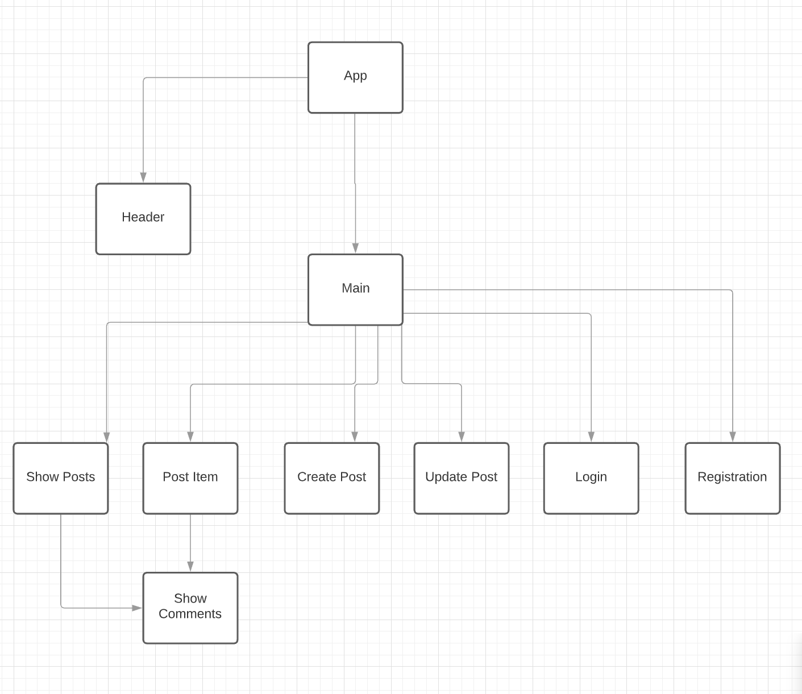

- [Overview](#overview)
- [MVP](#mvp)
  - [Goals](#goals)
  - [Libraries](#libraries)
  - [Client (Front End)](#client-front-end)
    - [Wireframes](#wireframes)
    - [Component Tree](#component-tree)
    - [Component Hierarchy](#component-hierarchy)
    - [Component Breakdown](#component-breakdown)
    - [Component Estimates](#component-estimates)
  - [Server (Back End)](#server-back-end)
    - [ERD Model](#erd-model)
- [Post-MVP](#post-mvp)
- [Code Showcase](#code-showcase)
- [Code Issues & Resolutions](#code-issues--resolutions)

<br>

## Overview

_**Community Forum** is a neighborhood forum for news, events, services, and recommendations. Users can post text and images as well as like and comment user posts._


<br>

## MVP

### Server (Back End)
- Have a RESTful JSON API.
- Build a Ruby on Rails server, exposing RESTful JSON endpoints.
- Build a database with at least 3 tables:
  - 1 user table
  - 2 other tables, of your choosing
- There must be at least 1 association between your tables. (1:m or m:m)
- Utilize Rails to define models for interacting with the database.
- Implement Authentication using JWT.
- Implement working generic controller actions for full-CRUD (index, show, create, update, delete) between the 2 non-user tables AND partial-CRUD (create, at least) for the user table.
### Client (Front End)
- Have a working, interactive React app, built using npx create-react-app.
- Have at least 8 separate, rendered components in an organized and understandable React file structure.
- Utilize functional and class React components appropriately.
- Utilize state and props in your components efficiently.
- Use only React for DOM Manipulation.
- Consume data from your Ruby on Rails API, and render that data in your components.
- Utilize React Router, for client-side routing.
- Utilize Authentication, permitting the user to:
- Register, login, and send authenticated requests.
- Perform index or show actions, whether or not they are logged in.
- Perform create, update, and delete actions when logged in.
- Unless it makes sense for that information to be restricted to particular users.

### Styling
- Be styled with CSS (or SCSS, if you'd prefer).
- Use flexbox or Grid in your layout design.
- Implement 2 media queries for responsive design on 3 screen sizes (including desktop).


<br>

### Goals

- Get to MVP by Friday
- 

<br>

### Libraries


|     Library      | Description                                |
| :--------------: | :----------------------------------------- |
|      React       | _Lorem ipsum dolor sit amet, consectetur._ |
|   React Router   | _Lorem ipsum dolor sit amet, consectetur._ |
|   Ruby on Rails   | _Lorem ipsum dolor sit amet, consectetur._ |

<br>

### Client (Front End)

#### Wireframes


- Desktop Landing


- Desktop Hero


- Resource Index


- Resource Show


- Tablet Resource Index


- Mobile Resource Index

#### Component Tree

https://app.lucidchart.com/invitations/accept/0e47a9dc-dacf-4320-a04b-dd9731a79dac



#### Component Hierarchy

``` structure

src
|__ assets/
      |__ fonts
      |__ images
|__ components/
    |__ App.jsx
      |__ Header.jsx
      |__ Main.jsx
        |__ Login.jsx
        |__ Registration.jsx
        |__ ShowPosts.jsx
        |__ PostItem.jsx
        |__ CreatePost.jsx
        |__ UpdatePost.jsx
|__ services/

```

#### Component Breakdown

> Use this section to go into further depth regarding your components, including breaking down the components as stateless or stateful, and considering the passing of data between those components.

|  Component   |    Type    | state | props | Description                                                      |
| :----------: | :--------: | :---: | :---: | :--------------------------------------------------------------- |
|    Header    | class |   n   |   n   | _The header will contain the navigation, username, and logo._               |
|   ShowPosts    |   class    |   y   |   n   | _Lorem ipsum dolor sit amet, consectetur._      |
| PostItem | class |   n   |   y   | _Lorem ipsum dolor sit amet, consectetur.__                 |
|    Footer    | functional |   n   |   n   | _The footer will show info about me and a link to my portfolio._ |

#### Component Estimates

> Use this section to estimate the time necessary to build out each of the components you've described above.

| Task                | Priority | Estimated Time | Time Invested | Actual Time |
| ------------------- | :------: | :------------: | :-----------: | :---------: |
| Add Contact Form    |    L     |     3 hrs      |     2 hrs     |    3 hrs    |
| Create CRUD Actions |    H     |     3 hrs      |     1 hrs     |     TBD     |
| TOTAL               |          |     6 hrs      |     3 hrs     |     TBD     |

> _Why is this necessary? Time frames are key to the development cycle. You have limited time to code your app, and your estimates can then be used to evaluate possibilities of your MVP and post-MVP based on time needed. It's best you assume an additional hour for each component, as well as a few hours added to the total time, to play it safe._

<br>

### Server (Back End)

#### ERD Model


<br>

***

## Post-MVP

> Use this section to document ideas you've had that would be fun (or necessary) for your Post-MVP. This will be helpful when you return to your project after graduation!

***

## Code Showcase

> Use this section to include a brief code snippet of functionality that you are proud of and a brief description.

## Code Issues & Resolutions

> Use this section to list of all major issues encountered and their resolution, if you'd like.